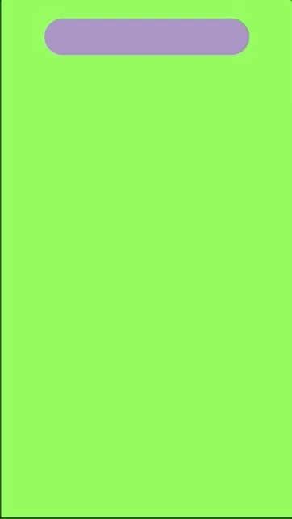

<h3>A Digital Pond</h3>

<strong>ChromaPulse</strong> demonstrates how responsive, visually brilliant apps don't necessitate convoluted codebases.

<ul>
    <li>A _UIVisualEffectView_ just below the status bar facilitateing navigtion between a pallette of purple background views.</li>
    <li>User interactions outside of the _UIVisualEffectView_ yield a bevy of polychromatic ripples that follow the user's touch. Each ripple starts square, then grows, rounds, and fades back to the nothingness from which it came.</li>
</ul>

<em>The screenshot below illustrates the growing "ripples" tracking touch events on the green "pond". Touches began with the large purple square just left of center and curled around twice before ending in the top-righthand corner, demarcated by the smallest square. </em>
  

<h3>Construction and UI Elements</h3>

- <strong><u>Template:</u></strong>
	- Single View Application  
 
- <strong><u>Frameworks:</u></strong>
	- Core Graphics
 
- <strong><u>Mechanism:</u></strong>
	- Squares/"ripples" = subclassed <strong>UIView</strong> called according to touch event
	- Background colors are an array indexed into by swiping left or right on the occluded region 
	  
- Occluded region = subclassed <strong>UIButton</strong> responsive only to left and right swiping (*The Swift version I'm currently building will use a <strong>UIPanGestureRecognizer</strong>*)

<h3>Going Forward</h3>
	- Leverage Apple's latest UITesting 
	- Make a Swift version and quantify differences in speed and size of app.

