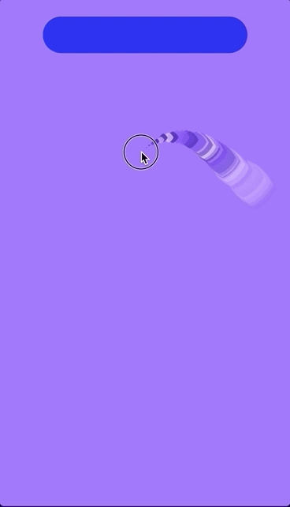

<h3>A Digital Pond</h3>

<strong>ChromaPulse</strong> demonstrates how responsive, visually brilliant apps don't always require copious code. <strong>ChromPulse</strong> recognizes touch events, as well as any changes therein, responding with a myriad of polychromatic boxes (none of the same color as the current background) pulse, growing outward from their perspective touch events for 2 iterations before fading out.

<em>The screenshot below illustrates the growing "rippes" tracking touch events on the green "pond". Touches began with the large purple square just left of center and curled around twice before ending in the top-righthand corner, demarcated by the smallest square. </em>
  

<h3>Construction and UI Elements</h3>

- <strong><u>Template:</u></strong>
 - <strong>Single View Application</strong>
- <strong><u>Frameworks:</u></strong>
 - <strong>Core Graphics</strong>
- <strong><u>Mechanism:</u></strong>
 - Squares/"ripples" = subclassed <strong>UIView</strong> called according to touch event
 - Background colors are an array indexed into by swiping left or right on the occluded region 
	  - Occluded region = subclassed <strong>UIButton</strong> responsive only to left and right swiping (*The Swift version I'm currently building will use a <strong>UIPanGestureRecognizer</strong>*)

-
 
<h3>Going Forward</h3>

Make a Swift version and quantify differences in speed and size of app.

